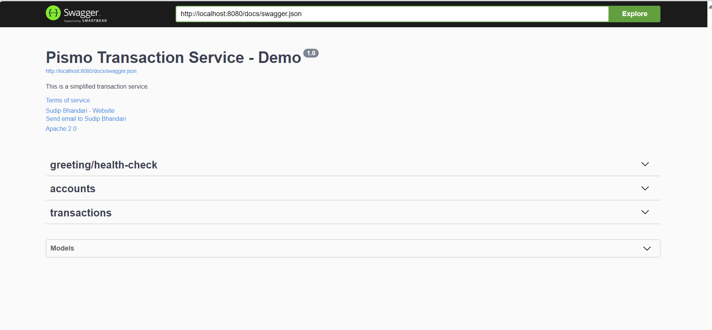

### Pismo Transaction Service Demo

For a quick spin:

Run `docker compose up` and head over to [swagger documentation](http://localhost:8080/swagger/index.html)


### Development

#### Dependencies:
```sh
1. go1.23
2. golang-migrate for schema migration github.com/golang-migrate/migrate/v4/cmd/migrate
3. swaggo for documentation generation `github.com/swaggo/swag/cmd/swag`
4. postgres DB
5. gomock for mock generation
6. godotevn for env management `github.com/joho/godotenv`
```

1. Clone the repo
2. Install go1.23 (use a version manager like gvm: `gvm install go1.23 && gvm use go1.23`)
3. Download the dependencies (`go mod download`)
4. Create mocks and documentation (`go generate ./... && swag init`) (or run `sh generate_doc.sh`)
5. Start the dependencies `docker compose up db`
6. Start the app `go run ./...` (the sample .env works with the docker config and there is no need to change anything)
7. Access the swagger UI `http://localhost:8080/swagger/index.html`


#### Swagger Documentation



#### Testing
This has 3 layers of testing:
- handler (controller testing)
- service layer testing
- storage (postgres) testing

Setup up test postgres `docker compose up db-test`

`go test ./...`